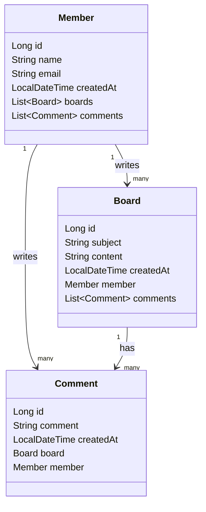

```mermaid
classDiagram
class Member {
Long id
String name
String email
LocalDateTime createdAt
List~Board~ boards
List~Comment~ comments
}

    class Board {
        Long id
        String subject
        String content
        LocalDateTime createdAt
        Member member
        List~Comment~ comments
    }

    class Comment {
        Long id
        String comment
        LocalDateTime createdAt
        Board board
        Member member
    }

    Member "1" --> "many" Board : writes
    Member "1" --> "many" Comment : writes
    Board  "1" --> "many" Comment : has
```
